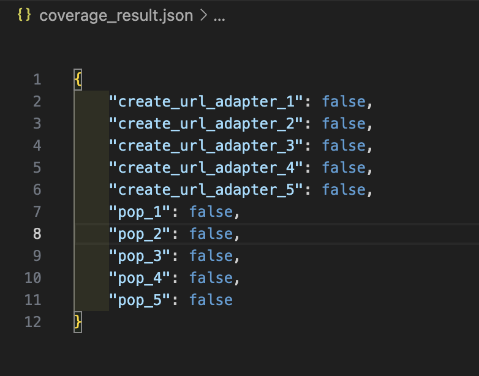
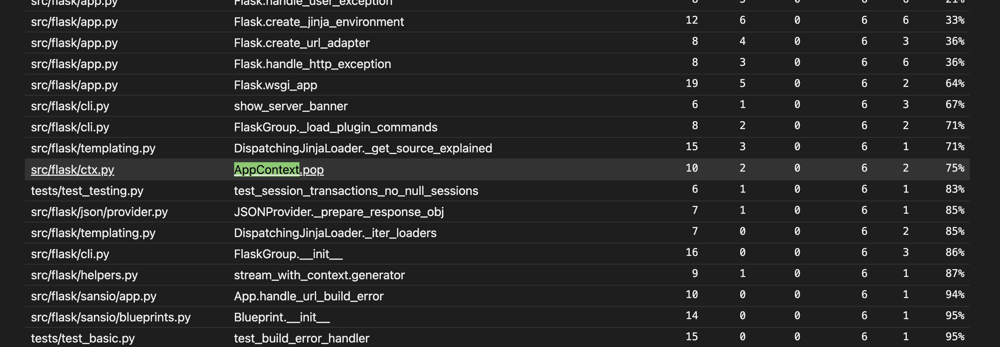
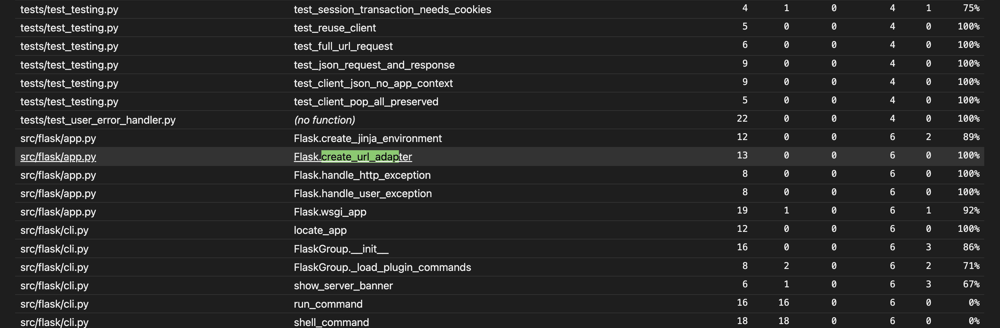
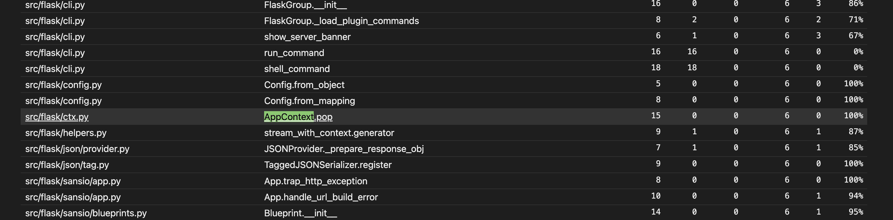

# Report for Assignment 1

## Project chosen

Name: Flask

URL: https://github.com/pallets/flask

Number of lines of code and the tool used to count it: 782430 counted using Lizard

Programming language: Python

## Coverage measurement

### Existing tool

The existing tool used for measuring coverage is coverage.py. It was executed using the following command: 
```coverage run -m pytest```


<Show the coverage results provided by the existing tool with a screenshot>


### Your own coverage tool

<The following is supposed to be repeated for each group member>

Group member name: Alexandr Costei

Function 1: 'create_url_adapter'

Commit made: https://github.com/wasimic311/flask/commit/510783b87887defc464210f6a2b30c539acc1ce8

<Provide a screenshot of the coverage results output by the instrumentation>




Function 2: 'AppContext.Pop'

Commit made: https://github.com/wasimic311/flask/commit/b048625880ba532b8e503c6c8d65ccc9e761f576

<Provide a screenshot of the coverage results output by the instrumentation>




## Coverage improvement

### Individual tests

<The following is supposed to be repeated for each group member>

<Group member name>
Group member name: Alexandr Costei


Test 1: 'create_url_adapter'


<Show a patch (diff) or a link to a commit made in your forked repository that shows the new/enhanced test>
Commit made: https://github.com/wasimic311/flask/commit/510783b87887defc464210f6a2b30c539acc1ce8


<Provide a screenshot of the old coverage results (the same as you already showed above)>


<Provide a screenshot of the new coverage results>



<State the coverage improvement with a number and elaborate on why the coverage is improved>
The coverage was improved by 64%, because the tests now cover all the branches in the create_url_adapter function, including scenarios for requests with and without subdomains and handling various configurations.

Test 2: 'AppContext.Pop'

Commit made: https://github.com/wasimic311/flask/commit/b048625880ba532b8e503c6c8d65ccc9e761f576


<Provide a screenshot of the old coverage results (the same as you already showed above)>


<Provide a screenshot of the new coverage results>


The coverage was improved by 25%%, because the tests now cover all branches in the AppContext.pop method, including scenarios for handling exceptions and context mismatches.

### Overall

<Provide a screenshot of the old coverage results by running an existing tool (the same as you already showed above)>

<Provide a screenshot of the new coverage results by running the existing tool using all test modifications made by the group>

## Statement of individual contributions

<Write what each group member did>
Alexandr Costei: During the selection of the functions that had to be tested, I picked 2 functions that did not have 100% branch coverage: "create_url_adapter" and "AppContext.Pop".  In order to create the necessary tests, I have:
- Analyzed the existing code to identify the branches and edge cases that needed to be tested.
- Wrote new unit tests to cover these scenarios.
- Integrated branch tracking to monitor and ensure coverage improvements.
- Committed the changes to the forked repository with detailed commit messages for traceability.