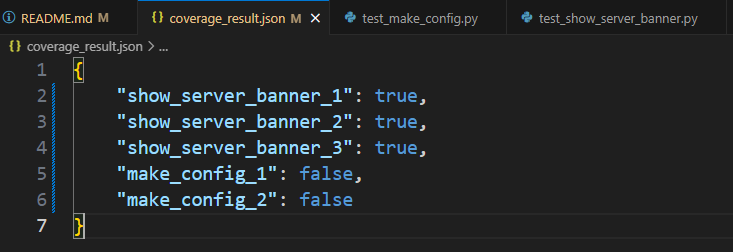
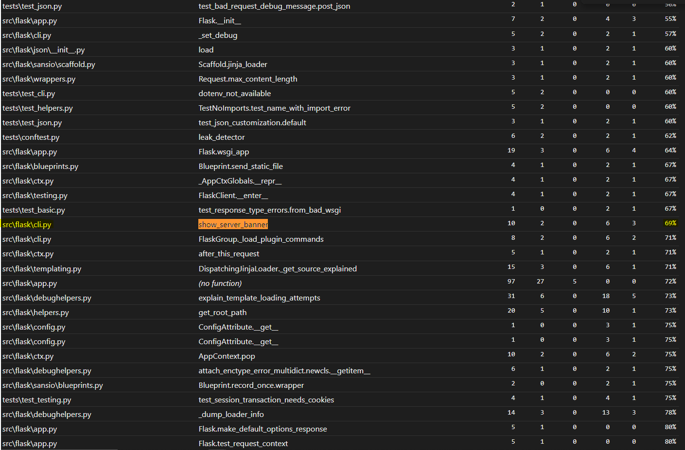
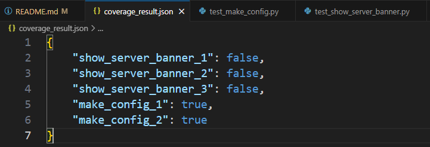
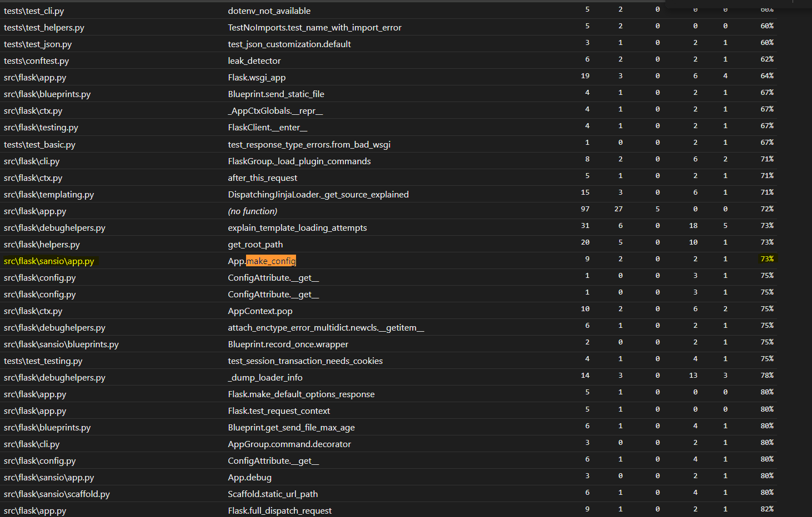
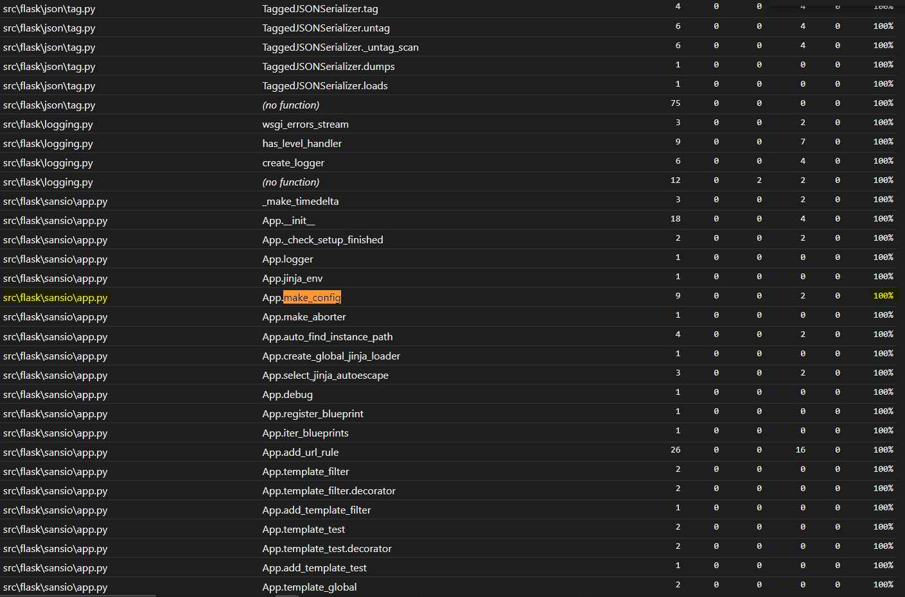

# Report for Assignment 1

## Project chosen

Name: Flask

URL: https://github.com/pallets/flask

Number of lines of code and the tool used to count it: 782430 counted using Lizard

Programming language: Python

## Coverage measurement

### Existing tool

The existing tool used for measuring coverage is coverage.py. It was executed using the following command: 

```coverage run -m pytest```


<Show the coverage results provided by the existing tool with a screenshot>


### Your own coverage tool

<The following is supposed to be repeated for each group member>

Group member name: Wasim Albarazi

Function 1: 'show_server_banner'

Commit made: [Commit for show_server_banner](https://github.com/pallets/flask/commit/f7549030d395a498cd3e5a9756647d0994f73cfd)

<Provide a screenshot of the coverage results output by the instrumentation>





Function 2: 'make_config'

Commit made: [Commit for make_config](https://github.com/pallets/flask/commit/d498fae3aaac40c0b050ae7c1fcda63351977bb9)

<Provide a screenshot of the coverage results output by the instrumentation>




## Coverage improvement

### Individual tests

<The following is supposed to be repeated for each group member>


Group member name: Wasim Albarazi

Test 1: test_show_server_banner.py

Commit made: [Commit for test_show_server_banner](https://github.com/pallets/flask/compare/main...wasimic311:flask:development_tests#diff-cfe75c0abbe6324af13dd6b3eaefc51d169788685c2503bd2e480fd02f2e24ae)

Old:


New:


The coverage improved by 25%, from 69% to 94%.

This improvement is due to:

New Test Cases: Added tests for show_server_banner under different conditions, such as with and without reloader and with no import path.
Branch Coverage: Explicit checks ensure that all branches in the show_server_banner function are covered.
Coverage Reporting: Added functionality to save coverage data to a JSON file, ensuring comprehensive coverage tracking.

These additions ensure that almost all code paths are executed during testing.


Group member name: Wasim Albarazi

Test 1: test_make_config.py

Commit made: [Commit for test_make_config.py](https://github.com/pallets/flask/compare/main...wasimic311:flask:development_tests#diff-94858dbd7f6f8bb4dbeac2b9f2f68a13407f31324fb755bfea914d7695802ff8)

Old:


New:



The coverage improved by 27%, from 73% to 100%.

This improvement is due to:

New Test Cases: Added tests for make_config under default and instance-relative conditions.
Branch Coverage: Explicit checks for all branches in make_config.

These additions ensure all code paths are tested.


### Overall

<Provide a screenshot of the old coverage results by running an existing tool (the same as you already showed above)>

<Provide a screenshot of the new coverage results by running the existing tool using all test modifications made by the group>

## Statement of individual contributions

<Write what each group member did>
