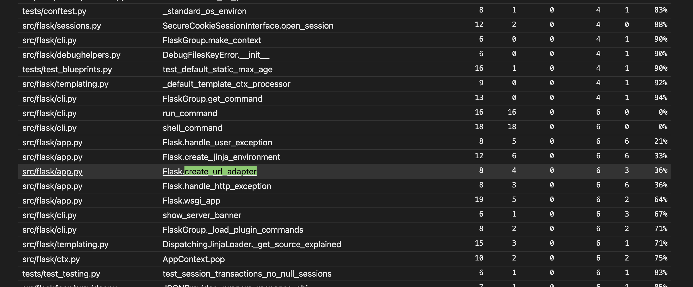
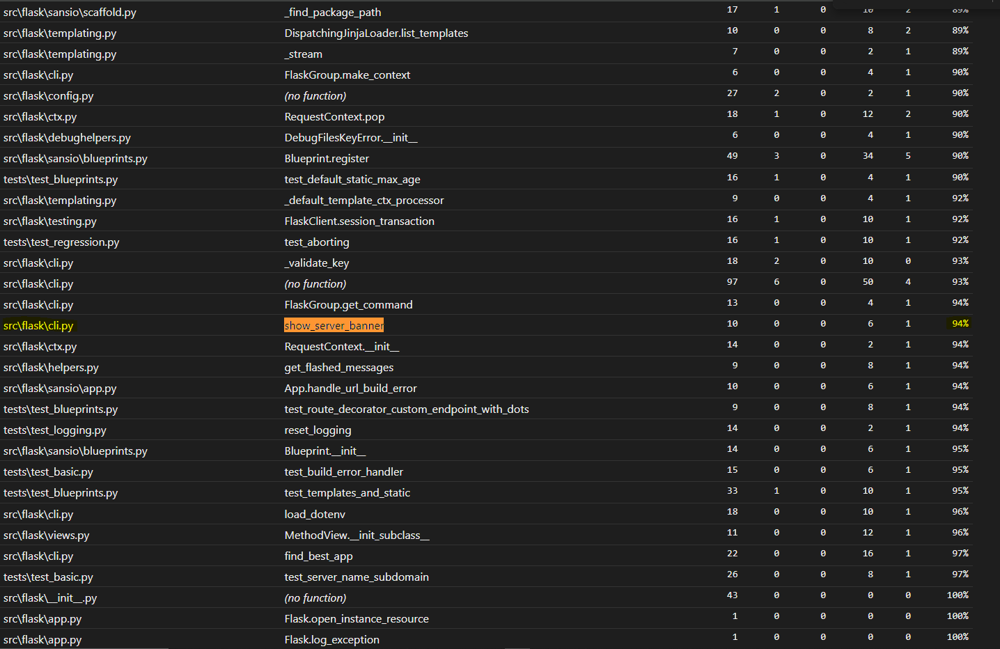

# Report for Assignment 1

## Project chosen

Name: Flask

URL: https://github.com/pallets/flask

Number of lines of code and the tool used to count it: 782430 counted using Lizard

Programming language: Python

## Coverage measurement

### Existing tool

The existing tool used for measuring coverage is coverage.py. It was executed using the following command: 

```coverage run -m pytest```


### Your own coverage tool

Group member name: Jannes van den Bogert

Function 1 name: 'get_send_file_max_age'

Commit made: [get_send_file_max_age](https://github.com/pallets/flask/commit/3c984992b97935e17d8f2d42c84128b397cd0e7e)

<Provide a screenshot of the coverage results output by the instrumentation>


Function 2 name: dispatch_request

Commit made: [Commit for dispatch_request](https://github.com/pallets/flask/commit/3c984992b97935e17d8f2d42c84128b397cd0e7e)

<Provide a screenshot of the coverage results output by the instrumentation>


Group member name: Wasim Albarazi

Function 1: 'show_server_banner'

Commit made: [Commit for show_server_banner](https://github.com/pallets/flask/commit/f7549030d395a498cd3e5a9756647d0994f73cfd)

<Provide a screenshot of the coverage results output by the instrumentation>


Function 2: 'make_config'

Commit made: [Commit for make_config](https://github.com/pallets/flask/commit/d498fae3aaac40c0b050ae7c1fcda63351977bb9)

<Provide a screenshot of the coverage results output by the instrumentation>


Group member name: Alexandr Costei

Function 1: 'create_url_adapter'

Commit made: https://github.com/wasimic311/flask/commit/510783b87887defc464210f6a2b30c539acc1ce8

<Provide a screenshot of the coverage results output by the instrumentation>





Function 2: 'AppContext.Pop'

Commit made: https://github.com/wasimic311/flask/commit/b048625880ba532b8e503c6c8d65ccc9e761f576

<Provide a screenshot of the coverage results output by the instrumentation>


## Coverage improvement

### Individual tests

<The following is supposed to be repeated for each group member>

<Group member name>
Group member name: Alexandr Costei

Test 1: 'create_url_adapter'

Commit made: https://github.com/wasimic311/flask/commit/510783b87887defc464210f6a2b30c539acc1ce8


The coverage was improved by 64%, because the tests now cover all the branches in the create_url_adapter function, including scenarios for requests with and without subdomains and handling various configurations.


Test 2: 'AppContext.Pop'

Commit made: https://github.com/wasimic311/flask/commit/b048625880ba532b8e503c6c8d65ccc9e761f576


The coverage was improved by 25%, because the tests now cover all branches in the AppContext.pop method, including scenarios for handling exceptions and context mismatches.


Group member name: Jannes van den Bogert

Test 1 name: test_get_send_file_max_age

Commit made: [Commit for test_make_config.py](https://github.com/pallets/flask/compare/main...wasimic311:flask:dev_test_jannes)


The coverage improved by 54%, from 46% to 100%.


Test 2 name: test_dispatch_request

Commit made: [Commit for test_make_config.py](https://github.com/pallets/flask/compare/main...wasimic311:flask:dev_test_jannes)


The coverage improved by 58%, from 42% to 100%.


Group member name: Wasim Albarazi

Test 1: test_show_server_banner.py

Commit made: [Commit for test_show_server_banner](https://github.com/pallets/flask/compare/main...wasimic311:flask:development_tests#diff-cfe75c0abbe6324af13dd6b3eaefc51d169788685c2503bd2e480fd02f2e24ae)

Old:


New:



The coverage improved by 25%, from 69% to 94%.

This improvement is due to:

New Test Cases: Added tests for show_server_banner under different conditions, such as with and without reloader and with no import path.
Branch Coverage: Explicit checks ensure that all branches in the show_server_banner function are covered.
Coverage Reporting: Added functionality to save coverage data to a JSON file, ensuring comprehensive coverage tracking.

These additions ensure that almost all code paths are executed during testing.


Group member name: Wasim Albarazi

Test 1: test_make_config.py

Commit made: [Commit for test_make_config.py](https://github.com/pallets/flask/compare/main...wasimic311:flask:development_tests#diff-94858dbd7f6f8bb4dbeac2b9f2f68a13407f31324fb755bfea914d7695802ff8)

Old:


New:


The coverage improved by 27%, from 73% to 100%.

This improvement is due to:

New Test Cases: Added tests for make_config under default and instance-relative conditions.
Branch Coverage: Explicit checks for all branches in make_config.

These additions ensure all code paths are tested.

### Overall


## Statement of individual contributions


Alexandr Costei: During the selection of the functions that had to be tested, I picked 2 functions that did not have 100% branch coverage: "create_url_adapter" and "AppContext.Pop".  In order to create the necessary tests, I have:
    - Analyzed the existing code to identify the branches and edge cases that needed to be tested.
    - Wrote new unit tests to cover these scenarios.
    - Integrated branch tracking to monitor and ensure coverage improvements.

Jannes van den Bogert: I was responsible for designing and implementing two tests for the Flask application. The tests targeted two specific functions: get_send_file_max_age and dispatch_request. My contributions were helping in enhancing the test coverage from partial to complete for these functions, achieving a significant increase in overall coverage.

Wasim Albarazi: In our project, I was responsible for designing and implementing tests for two critical functions in our Flask application: show_server_banner and make_config. The tests were organized into two separate files, test_make_config.py and test_show_server_banner.py, each focused on validating the functionality and reliability of their respective functions.
Additionally, I developed a custom coverage tracking tool named coverage_tracker.py. This tool was instrumental in monitoring the test coverage across our application. It tracks the coverage of the test executions and stores the results in a JSON file called coverage_result.json. This implementation provided us with detailed insights into our test coverage, helping to ensure that we achieved comprehensive testing and improved the overall quality and robustness of our application.
